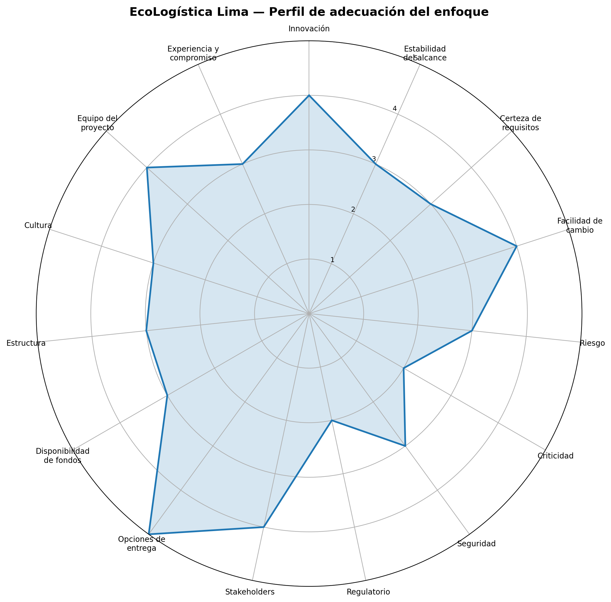

# 01. Selección del enfoque del proyecto V_1_0_0

## **EcoLogística Lima**
### *Optimizador de Rutas Sostenibles para DistriRápido S.A.C.*

---

## 1. Encabezado de metadatos

| Campo | Información |
|---|---|
| **Nombre del proyecto** | EcoLogística Lima — Optimizador de Rutas Sostenibles para DistriRápido S.A.C. |
| **Integrantes** | **[COMPLETAR: nombres y apellidos del equipo]** |
| **Fecha de emisión (ISO 8601)** | 2026-08-25 |
| **Versión** | 1.0.0 |
| **Estado** | Para revisión y aprobación |
| **Artefacto** | Selección y justificación del enfoque de desarrollo y gestión |

> **Criterio metodológico.** La selección se realiza mediante una matriz de 15 variables cuantificadas de 1 a 5. En ausencia de una ponderación diferencial explícita en el instrumento entregado, se utiliza **ponderación uniforme de 6,67 % por variable**, evitando introducir pesos arbitrarios.

---

## 2. Escala de evaluación

La escala se interpreta como un continuo entre previsibilidad y adaptabilidad:

| Puntaje | Interpretación | Orientación predominante |
|---:|---|---|
| **1** | Condiciones altamente estables, definidas y controlables | Predictiva |
| **2** | Predominio de estabilidad, regulación o necesidad de control previo | Predictiva |
| **3** | Equilibrio entre planificación y adaptación | Híbrida |
| **4** | Incertidumbre relevante, aprendizaje iterativo o cambios frecuentes | Ágil |
| **5** | Alta incertidumbre y necesidad de entregas iterativas frecuentes | Ágil |

Para la interpretación del resultado global se dividen los cinco niveles en tres intervalos equivalentes: **1,00–2,33 = Predictivo; 2,34–3,66 = Híbrido; 3,67–5,00 = Ágil**.

---

## 3. Matriz de ponderación de variables

| ID | Variable | Puntaje | Enfoque unitario | Peso | Aporte ponderado | Justificación técnica |
|---:|---|---:|---|---:|---:|---|
| V01 | Innovación | **4** | Ágil | 6,67 % | 0,267 | La optimización de rutas es un dominio tecnológicamente maduro; PTV, Drivin, SimpliRoute y Google ya resuelven capacidades, ventanas horarias, asignación de vehículos y, en algunos casos, emisiones. Por ello no corresponde un 5. Sin embargo, el proyecto mantiene incertidumbre relevante en la formulación multicriterio, estimación ambiental y contextualización para Lima, lo que requiere experimentación iterativa. |
| V02 | Estabilidad del alcance | **3** | Híbrido | 6,67 % | 0,200 | La consigna fija el propósito, el PMV web, el periodo de 12 semanas y entregables de gestión; no obstante, el detalle del optimizador, indicadores, restricciones logísticas y experiencia de usuario puede ajustarse durante la construcción. |
| V03 | Certeza de requisitos | **3** | Híbrido | 6,67 % | 0,200 | Existen requisitos macro claros, pero faltan parámetros operativos críticos: volumen de pedidos, capacidades reales, ventanas de atención, reglas de priorización, fuentes de tráfico y método de estimación de emisiones. |
| V04 | Facilidad de cambio | **4** | Ágil | 6,67 % | 0,267 | Al tratarse de un PMV web modular, los cambios en reglas, pesos del modelo, interfaz e indicadores pueden incorporarse por iteraciones si la arquitectura separa presentación, negocio, datos y optimización. |
| V05 | Riesgo | **3** | Híbrido | 6,67 % | 0,200 | Hay riesgos técnicos y de datos —geocodificación, calidad de matrices de viaje, dependencia de APIs, rendimiento del solver y estimación ambiental— que exigen prototipado temprano, pero también controles formales de riesgo y alcance. |
| V06 | Criticidad | **2** | Predictivo | 6,67 % | 0,133 | El PMV no es un sistema safety-critical ni controla directamente vehículos. No obstante, una recomendación errónea puede afectar tiempos, costos y cumplimiento de entregas, por lo que deben existir criterios de aceptación y validación antes de liberar la versión 1.0.0. |
| V07 | Seguridad | **3** | Híbrido | 6,67 % | 0,200 | El sistema puede procesar direcciones, datos operativos y potencialmente información de clientes o conductores. Se requiere una línea base de seguridad definida desde el inicio y revisiones iterativas durante el desarrollo. |
| V08 | Regulatorio | **2** | Predictivo | 6,67 % | 0,133 | No se ha definido una certificación logística obligatoria para el PMV; sin embargo, si se tratan datos personales debe considerarse la Ley N.º 29733 y su reglamento vigente. Esto favorece controles y trazabilidad documental. |
| V09 | Stakeholders | **4** | Ágil | 6,67 % | 0,267 | La calidad del producto depende de retroalimentación frecuente de usuario/cliente del caso, equipo, docente y responsables de operación. La validación temprana reduce el riesgo de construir funcionalidades poco útiles. |
| V10 | Opciones de entrega | **5** | Ágil | 6,67 % | 0,333 | La consigna exige evidencia de evolución progresiva del PMV. El producto puede dividirse naturalmente en incrementos: datos maestros, mapa, restricciones, optimización, métricas ambientales, comparación y dashboard. |
| V11 | Disponibilidad de fondos | **3** | Híbrido | 6,67 % | 0,200 | El presupuesto académico es limitado y el uso de APIs geoespaciales puede generar costos variables. Conviene fijar un techo presupuestal y, simultáneamente, validar alternativas gratuitas/open source por iteraciones. |
| V12 | Estructura | **3** | Híbrido | 6,67 % | 0,200 | El proyecto exige estructura formal de repositorio, documentación PMBOK, versionado y evidencias, mientras el desarrollo de software se beneficia de ciclos iterativos. La coexistencia de gobernanza formal y ejecución adaptativa es explícita. |
| V13 | Cultura | **3** | Híbrido | 6,67 % | 0,200 | No existe evidencia suficiente para asumir una cultura plenamente ágil o predictiva en la organización del caso. Se adopta una valoración neutral que deberá revisarse al confirmar prácticas y disponibilidad de los participantes. |
| V14 | Equipo del proyecto | **4** | Ágil | 6,67 % | 0,267 | El trabajo académico en equipo favorece comunicación directa, colaboración, revisión por pares y distribución flexible de tareas. La efectividad dependerá de definir roles, Definition of Done y disciplina de integración. |
| V15 | Experiencia y compromiso | **3** | Híbrido | 6,67 % | 0,200 | No se dispone aún de una medición objetiva de experiencia previa en optimización, SIG, backend, frontend y gestión. Se mantiene una valoración neutral hasta validar competencias y disponibilidad. |
|  | **Resultado** |  |  | **100 %** | **3,27 / 5,00** | **Clasificación global: HÍBRIDO.** |

### 3.1. Distribución del perfil

- Variables con orientación **predictiva (1–2): 2 de 15**.
- Variables con orientación **híbrida (3): 8 de 15**.
- Variables con orientación **ágil (4–5): 5 de 15**.
- **Promedio ponderado: 3,27/5,00.**

**<u>Conclusión cuantitativa:</u>** el perfil se ubica dentro del intervalo híbrido y presenta una **tendencia adaptativa moderada**, principalmente por la necesidad de iterar el PMV, validar stakeholders y refinar el modelo de optimización.

---

## 4. Benchmarking que condiciona la selección del enfoque

El análisis comparativo evita calificar como “innovador” aquello que ya es estándar de mercado y demuestra por qué el desarrollo necesita ciclos de aprendizaje.

| Referente | Capacidades comparables con EcoLogística Lima | Implicación para el proyecto |
|---|---|---|
| **Google Route Optimization API** | Optimización de flotas, capacidades, ventanas horarias, horarios de vehículos, asignación de envíos y objetivos de eficiencia. | El proyecto no debe limitarse a “ordenar paradas”; necesita justificar su modelo, indicadores y evaluación experimental. |
| **PTV Route Optimiser** | Asignación de envíos a rutas/vehículos, planificación de flota y cálculo de emisiones por trayecto. | La sostenibilidad no constituye innovación por sí sola. Debe operacionalizarse y contextualizarse. |
| **Drivin** | Optimización de rutas y dashboard de emisiones; enfoque explícito en reducción de huella de carbono. | Es un benchmark regional directo para la propuesta de valor sostenible. |
| **SimpliRoute** | Capacidades, turnos, ventanas horarias y optimización con variables operativas. | Confirma que las restricciones logísticas básicas ya son funcionalidad madura y deben tratarse como baseline. |

> **Hallazgo clave:** la diferenciación académica debe centrarse en la **formulación transparente del problema**, la combinación de indicadores operativos y ambientales, la adaptación al contexto de Lima y la **validación cuantitativa frente a baselines**, no en acumular funciones comerciales.

---

## 5. Diagrama de radar del enfoque

**Lectura del radar.** Los picos en **opciones de entrega, innovación, facilidad de cambio, stakeholders y equipo** favorecen ciclos iterativos. Los valores bajos en **criticidad y regulación** indican que esas dimensiones requieren mayor control y documentación previa. La concentración de valores en 3 confirma que una estrategia puramente ágil o puramente predictiva sería menos adecuada que un enfoque combinado.

---

## 6. Decisión y justificación del enfoque

### 6.1. Enfoque seleccionado

> ## **ENFOQUE HÍBRIDO CON ÉNFASIS ADAPTATIVO**

La selección del enfoque híbrido responde tanto al resultado cuantitativo (**3,27/5,00**) como a la naturaleza dual del proyecto: existe un conjunto de compromisos **fijos y verificables** —12 semanas, PMV v1.0.0, estructura de repositorio, documentación, hitos, control de versiones y arquitectura—, pero el núcleo técnico posee **incertidumbre progresiva** en requisitos, datos, heurísticas, restricciones y métricas ambientales.

ISO 21502:2020 reconoce que un proyecto puede emplear enfoques predictivos, incrementales, iterativos, adaptativos o híbridos según su contexto. De manera consistente, PMBOK 8.ª edición mantiene el énfasis en principios, dominios de desempeño y *tailoring*: el método debe ajustarse a la realidad del proyecto en lugar de imponer un ciclo de vida único.

### 6.2. Componentes predictivos

Se gestionarán de forma planificada y controlada:

1. Acta de constitución y línea base de objetivos.
2. Presupuesto máximo y calendario de 12 semanas.
3. Arquitectura macro frontend/backend y criterios de calidad.
4. Riesgos, seguridad, cumplimiento y dependencias externas.
5. Convenciones de repositorio, flujo Git, versionado semántico y release v1.0.0.
6. Hitos académicos, documentación obligatoria y criterios de aceptación.

### 6.3. Componentes ágiles/adaptativos

Se ejecutarán mediante ciclos cortos de construcción-validación:

1. Backlog priorizado por valor y riesgo.
2. Iteraciones recomendadas de **2 semanas**.
3. Demostración de incremento funcional al cierre de cada iteración.
4. Prototipado temprano del motor de optimización y de la integración geoespacial.
5. Refinamiento incremental de restricciones, parámetros e indicadores.
6. Validación comparativa contra baselines antes de ampliar funcionalidades.
7. Pull requests, revisión por pares y pruebas continuas.

### 6.4. Regla de gobierno del cambio

Los cambios que afecten **propósito, fecha final, presupuesto máximo, arquitectura macro o alcance crítico** deberán someterse a control formal. Los cambios de **UX, parámetros del optimizador, reglas secundarias, visualizaciones e indicadores no críticos** podrán gestionarse mediante el backlog priorizado mientras no comprometan la línea base.

### 6.5. Justificación final

Un enfoque predictivo puro obligaría a fijar prematuramente requisitos que hoy no están totalmente definidos y aumentaría el costo de corregir supuestos técnicos. Un enfoque ágil puro, en cambio, sería insuficiente para un proyecto académico que exige trazabilidad, documentos formales, hitos, control de configuración, presupuesto y una versión final comprometida. El **enfoque híbrido** ofrece el equilibrio más defendible: **gobernanza estable para los compromisos y aprendizaje iterativo para la solución**.

---

## 7. Referencias — formato ISO 690 simplificado

1. PROJECT MANAGEMENT INSTITUTE. *A Guide to the Project Management Body of Knowledge (PMBOK® Guide) — Eighth Edition*. Newtown Square, PA: PMI, 2025. Disponible en: https://www.pmi.org/standards/pmbok [consulta: 2026-08-25].
2. INTERNATIONAL ORGANIZATION FOR STANDARDIZATION. *ISO 21502:2020. Project, programme and portfolio management — Guidance on project management*. Geneva: ISO, 2020. Disponible en: https://www.iso.org/standard/74947.html [consulta: 2026-08-25].
3. GOOGLE. *Route Optimization API — Overview*. Google for Developers. Disponible en: https://developers.google.com/maps/documentation/route-optimization/overview [consulta: 2026-08-25].
4. PTV LOGISTICS. *PTV Route Optimiser — Software de optimización de rutas*. Disponible en: https://www.ptvlogistics.com/es/productos/ptv-route-optimiser [consulta: 2026-08-25].
5. DRIVIN. *Sostenibilidad: optimización de rutas y dashboard de emisiones*. Disponible en: https://driv.in/sostenibilidad [consulta: 2026-08-25].
6. SIMPLIROUTE. *API Reference — Optimización*. Disponible en: https://documentation.simpliroute.com/es/ [consulta: 2026-08-25].
7. PERÚ. *Ley N.º 29733, Ley de Protección de Datos Personales*. 2011; Reglamento aprobado por Decreto Supremo N.º 016-2024-JUS, vigente desde 2025. Disponible en: https://www.gob.pe/institucion/anpd/normas-legales/6554453-16-2024-jus [consulta: 2026-08-25].

---

**Control de cambios**

| Versión | Fecha | Descripción |
|---|---|---|
| 1.0.0 | 2026-08-25 | Emisión inicial de la selección y justificación del enfoque. |
