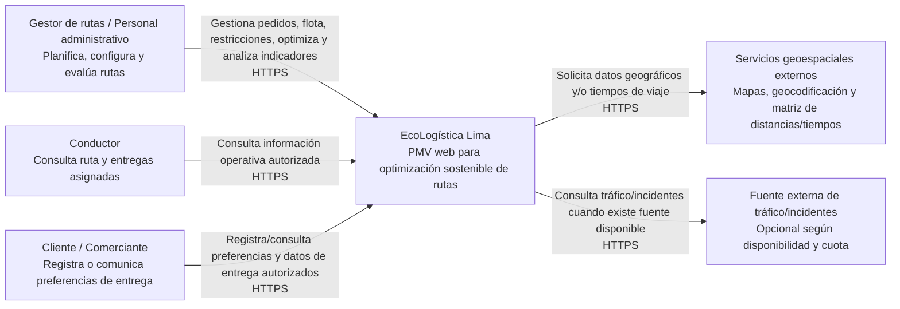
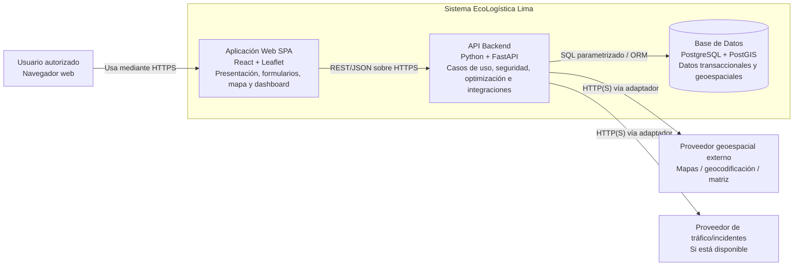
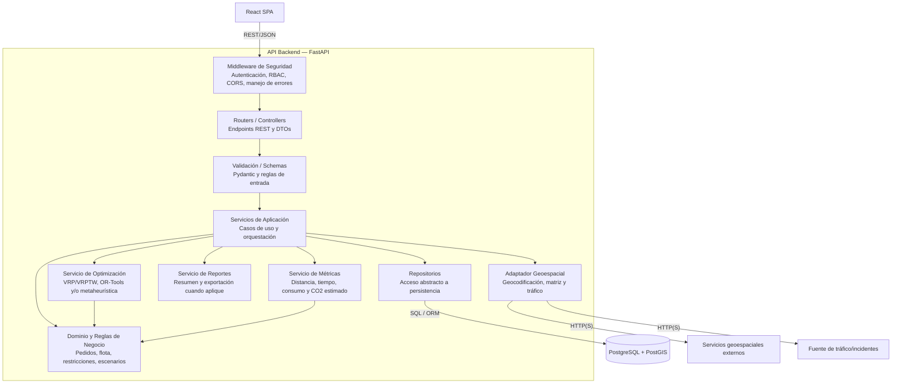

# 12. Modelo C4 V_1_0_0

## EcoLogística Lima — Arquitectura de Software

**Proyecto:** EcoLogística Lima — Optimizador de Rutas Sostenibles para DistriRápido S.A.C.  
**Documento:** Arquitectura de Software — Modelo C4  
**Versión:** 1.0.0  
**Fecha de emisión (ISO 8601):** 2026-09-07  
**Ruta objetivo del repositorio:** `doc/01_Inicio/12. Modelo C4 V_1_0_0.md`  
**Estado:** Para revisión y aprobación  
**Director del Proyecto:** La Torre Párraga, Alvaro Andree  
**Integrantes:** Caldas Alanya, Marvin Usias; Guevara Chamorro, Augusto Jose; La Torre Párraga, Alvaro Andree; Yanarico Ticona, Ivan Josue.

---

## 1. Propósito y alcance

El presente documento define la arquitectura lógica de **EcoLogística Lima** mediante los tres niveles del modelo C4 requeridos para el PMV:

1. **Nivel 1 — Contexto:** personas, sistema y dependencias externas.
2. **Nivel 2 — Contenedores:** aplicaciones y almacenes de datos que conforman la solución.
3. **Nivel 3 — Componentes:** estructura interna del contenedor API Backend.

Los diagramas se expresan en **Mermaid** para mantenerlos versionables, revisables mediante pull requests y renderizables directamente desde Markdown en el repositorio.

La arquitectura se alinea con la línea base del Acta de Constitución: aplicación web, separación explícita frontend/backend, comunicación mediante API, uso de PostgreSQL/PostGIS, encapsulamiento de servicios geoespaciales y un PMV orientado a apoyar la toma de decisiones del planificador logístico.

> **Criterio de arquitectura:** el PMV no es un sistema de conducción autónoma ni un TMS productivo de misión crítica. Las rutas generadas son recomendaciones operativas sujetas a validación humana.

---

## 2. Drivers arquitectónicos

| Driver | Implicación arquitectónica |
|---|---|
| PMV web en 12 semanas | Arquitectura modular, tecnologías conocidas por el equipo y vertical slices integrables por iteración. |
| Presupuesto monetario directo ≤ S/ 500 | Preferencia por software open source, free tiers, infraestructura de bajo consumo y control de llamadas a APIs externas. |
| Optimización de rutas | Separación del motor de optimización respecto de controladores, persistencia y UI. |
| Información geoespacial | PostgreSQL + PostGIS y adaptadores desacoplados para mapas, geocodificación y matrices de viaje. |
| Rendimiento del PMV | Servicio de optimización aislado, medición reproducible y límites explícitos de tamaño de problema. |
| Seguridad y privacidad | HTTPS, autenticación/autorización basada en roles, minimización de datos, hash de contraseñas y secretos fuera del repositorio. |
| Mantenibilidad | Capas con responsabilidades definidas, interfaces entre componentes, pruebas automatizables y documentación de API. |
| Sostenibilidad | Medición de distancia/consumo/emisiones, consultas eficientes, reutilización de resultados externos cuando sea válido y despliegue dimensionado al uso real. |
| Dependencia de APIs externas | Patrón Adapter/Ports & Adapters para permitir sustitución de proveedor y evitar acoplamiento directo del dominio. |

---

## 3. Decisiones tecnológicas de referencia

| Capa | Tecnología / decisión | Responsabilidad |
|---|---|---|
| Frontend | React | SPA responsive para gestión, visualización cartográfica y dashboard. |
| Backend | Python + FastAPI | API REST/JSON, reglas de aplicación, coordinación del optimizador y seguridad. |
| Optimización | Python; OR-Tools y/o metaheurística seleccionada | Resolver VRP/VRPTW o variante ambiental bajo restricciones configuradas. |
| Persistencia | PostgreSQL + PostGIS | Datos transaccionales, integridad relacional y soporte geoespacial. |
| Cartografía | Leaflet + OpenStreetMap o proveedor equivalente | Visualización de mapas y capas geográficas. |
| Integraciones | Adaptadores HTTP | Geocodificación, matriz de distancias/tiempos y tráfico/incidentes cuando exista fuente válida. |
| Seguridad | HTTPS + RBAC; JWT o sesión segura según implementación | Autenticación, autorización y protección del acceso a endpoints. |
| Configuración | Variables de entorno / secret manager del proveedor | Evitar credenciales y claves en el repositorio. |

No se incorpora Redis, OAuth externo, SMTP ni otro contenedor adicional como requisito de arquitectura en esta versión, porque esos elementos no forman parte de la línea base tecnológica actualmente aprobada. Podrán añadirse mediante decisión arquitectónica documentada si un requisito posterior lo justifica.

---

# 4. Nivel 1 — Diagrama de Contexto

## 4.1. Objetivo

Mostrar quién utiliza EcoLogística Lima, qué responsabilidad tiene el sistema y de qué sistemas externos depende.

## 4.2. Responsabilidades del sistema

EcoLogística Lima concentra las siguientes responsabilidades:

- registrar y consultar pedidos/puntos de entrega;
- gestionar vehículos y restricciones de capacidad;
- definir ventanas horarias, tiempos de servicio y parámetros operativos;
- obtener o utilizar coordenadas y matrices de distancia/tiempo;
- generar asignaciones y secuencias para múltiples vehículos;
- calcular indicadores operativos y ambientales;
- visualizar rutas y paradas en mapa;
- comparar un escenario base con el escenario optimizado;
- restringir el acceso según rol y proteger información identificable.

## 4.3. Sistemas externos

Los servicios geoespaciales se modelan como dependencias externas porque su disponibilidad, costos, cuotas y condiciones de uso no están bajo control del equipo. La arquitectura evita que el dominio dependa de un proveedor concreto mediante una interfaz de integración.

La fuente de tráfico/incidentes es **opcional** para el PMV: cuando no exista información confiable o disponible, el sistema debe continuar utilizando los datos base permitidos y comunicar la limitación al usuario en lugar de inventar condiciones de tráfico.

---

# 5. Nivel 2 — Diagrama de Contenedores

## 5.1. Objetivo

Representar las principales unidades ejecutables o de almacenamiento de EcoLogística Lima y sus relaciones.

## 5.2. Catálogo de contenedores

| Contenedor | Tecnología | Responsabilidad | Datos principales |
|---|---|---|---|
| Aplicación Web SPA | React + Leaflet | Interfaz de gestión, formularios, mapa, dashboard, comparación de escenarios y modo de consulta simplificado. | Estado efímero de UI; no debe persistir secretos. |
| API Backend | FastAPI / Python | Autenticación/autorización, validación, casos de uso, coordinación del motor de optimización, cálculo de métricas, reportes e integraciones externas. | DTOs, modelos de dominio y resultados temporales de cálculo. |
| Base de Datos | PostgreSQL + PostGIS | Persistencia transaccional, integridad referencial, información geoespacial e índices para consultas. | Usuarios, vehículos, conductores, clientes, pedidos y entidades que se incorporen para rutas/escenarios. |

## 5.3. Interfaces y protocolos

- **Navegador ↔ SPA:** HTTPS.
- **SPA ↔ API:** REST/JSON sobre HTTPS.
- **API ↔ PostgreSQL/PostGIS:** conexión SQL autenticada; consultas parametrizadas mediante driver/ORM.
- **API ↔ servicios externos:** HTTP(S) exclusivamente mediante adaptadores de infraestructura.
- **Secretos:** variables de entorno o mecanismo equivalente del proveedor; nunca en commits.
- **CORS:** restringido al origen o conjunto de orígenes necesarios para el despliegue.

## 5.4. Criterio de escalabilidad

Para el PMV se prioriza una arquitectura simple y desplegable con bajo costo. La API debe mantenerse **stateless respecto de la sesión de aplicación cuando sea viable**, permitiendo replicación horizontal futura. PostgreSQL/PostGIS conserva la fuente de verdad. La incorporación de cache distribuido, colas o workers queda condicionada a evidencia de necesidad y no se asume en v1.0.0.

---

# 6. Nivel 3 — Diagrama de Componentes del API Backend

## 6.1. Objetivo

Detallar la estructura interna del contenedor **API Backend**, separando presentación de API, seguridad, aplicación, dominio, optimización, persistencia e integraciones.

## 6.2. Responsabilidades por componente

| Componente | Responsabilidad | Regla de diseño |
|---|---|---|
| Routers / Controllers | Exponer endpoints, transformar entrada/salida y delegar casos de uso. | No contiene lógica de optimización ni SQL. |
| Middleware de Seguridad | Autenticar, autorizar, aplicar CORS, trazabilidad y manejo uniforme de errores. | Denegar por defecto; privilegio mínimo. |
| Validación / Schemas | Validar formato, tipos, rangos y contratos de API. | La validación estructural no reemplaza reglas de negocio. |
| Servicios de Aplicación | Orquestar casos de uso y transacciones. | Depende de interfaces, no de proveedores concretos. |
| Dominio y Reglas de Negocio | Modelar pedidos, flota, ventanas, restricciones y reglas verificables. | Independiente de HTTP, UI y proveedor de mapas. |
| Servicio de Optimización | Construir y resolver el modelo de ruteo. | Entrada/salida determinista cuando el algoritmo y semilla lo permitan; registrar parámetros de prueba. |
| Servicio de Métricas | Calcular indicadores operativos y ambientales. | Diferenciar estimación de medición real. |
| Servicio de Reportes | Preparar estructuras de reporte/exportación. | No recalcula lógica que ya pertenece a dominio/métricas. |
| Adaptador Geoespacial | Encapsular geocodificación, matrices, mapas y tráfico. | Sustituible por configuración; maneja timeout, cuota y error externo. |
| Repositorios | Persistir y recuperar agregados/datos. | Consultas parametrizadas; transacciones explícitas. |

---

# 7. Seguridad, privacidad y controles transversales

La arquitectura incorpora controles consistentes con los requisitos de seguridad y con la Ley N.º 29733 y su Reglamento vigente:

1. **Autenticación y autorización:** RBAC para limitar operaciones según rol.
2. **Contraseñas:** almacenar únicamente hashes mediante un algoritmo adecuado de derivación de claves; nunca contraseñas en texto plano.
3. **Transporte:** HTTPS en despliegues accesibles por red.
4. **Secretos:** variables de entorno o secret manager; prohibido versionarlos.
5. **Persistencia:** mínimo privilegio para el usuario de base de datos y respaldo protegido.
6. **Validación:** entrada validada en frontera y reglas de negocio verificadas en dominio.
7. **Logs:** no registrar contraseñas, tokens, claves de API ni datos personales innecesarios.
8. **Dependencias externas:** timeout, manejo de errores, límites de reintento y degradación controlada.
9. **Recomendación de rutas:** la interfaz debe permitir revisión humana; una salida del optimizador no se trata como instrucción autónoma de seguridad crítica.

---

# 8. Calidad, rendimiento y sostenibilidad

## 8.1. Rendimiento

La arquitectura permite medir por separado:

- latencia de API;
- tiempo de consulta geoespacial;
- tiempo de ejecución del optimizador;
- tiempo total extremo a extremo;
- tamaño del problema y parámetros usados.

La línea base de aceptación del Acta de Constitución para el PMV es **≤ 30 s para hasta 50 puntos de entrega y 5 vehículos** en el entorno de prueba definido por el equipo. Cualquier escenario más exigente debe registrarse como prueba adicional y no sustituir silenciosamente esa línea base.

## 8.2. Mantenibilidad

- separación entre interfaz, aplicación, dominio e infraestructura;
- adaptadores para servicios externos;
- repositorios para desacoplar persistencia;
- OpenAPI generado por FastAPI como contrato técnico;
- pruebas unitarias para dominio/optimización y pruebas de integración para API/DB/proveedores;
- trazabilidad de cambios mediante Git y pull requests.

## 8.3. Sostenibilidad técnica

- despliegue dimensionado al uso real;
- evitar procesos permanentes cuando no sean necesarios;
- reutilizar resultados geoespaciales válidos cuando la licencia y vigencia del dato lo permitan;
- usar índices relacionales y espaciales para reducir cómputo;
- registrar el tiempo de CPU/ejecución del optimizador en pruebas comparativas;
- reportar emisiones logísticas como **estimaciones** basadas en factores documentados, sin declarar certificación.

---

# 9. Trazabilidad arquitectura ↔ requisitos

| Elemento arquitectónico | Requisitos / necesidad que soporta |
|---|---|
| React SPA + Leaflet | Visualización de rutas, dashboard, interacción web responsive y accesible. |
| FastAPI | Separación frontend/backend, API, modularidad y pruebas. |
| Servicio de Optimización | Generación de rutas multi-vehículo y restricciones VRP/VRPTW. |
| Servicio de Métricas | Distancia, tiempo, utilización, consumo y CO₂ estimado. |
| PostgreSQL + PostGIS | Persistencia relacional, georreferenciación e integridad de datos. |
| Adaptador geoespacial | RT-03: reducir acoplamiento con mapas/geocodificación/tráfico. |
| Middleware de seguridad | Autenticación, autorización, protección de endpoints y control por roles. |
| Repositorios | Mantenibilidad, separación de responsabilidades y pruebas. |
| Servicio de reportes | Reportes de sostenibilidad cuando correspondan al alcance implementado. |

---

# 10. Restricciones y decisiones diferidas

No forman parte obligatoria de la arquitectura v1.0.0:

- aplicación móvil nativa;
- tracking GPS en tiempo real;
- colas distribuidas;
- Redis;
- microservicios;
- Kubernetes;
- autenticación OAuth con proveedor externo;
- machine learning propio para predicción de tráfico;
- operación 24x7 con SLA empresarial.

Estas tecnologías o capacidades solo deberán incorporarse si existe un requisito verificable, una justificación costo/beneficio y una decisión arquitectónica registrada.

---

# 11. Referencias

1. C4 Model. *The C4 model for visualising software architecture*. https://c4model.com/
2. Mermaid. *C4 Diagrams*. https://mermaid.js.org/syntax/c4.html
3. FastAPI. *Documentation*. https://fastapi.tiangolo.com/
4. PostgreSQL. *Documentation*. https://www.postgresql.org/docs/
5. PostGIS. *Documentation*. https://postgis.net/documentation/
6. W3C. *Web Content Accessibility Guidelines (WCAG) 2.1*. https://www.w3.org/TR/WCAG21/
7. Perú. Ley N.º 29733, Ley de Protección de Datos Personales; Reglamento aprobado por Decreto Supremo N.º 016-2024-JUS. https://www.gob.pe/institucion/anpd/normas-legales/6554453-16-2024-jus
8. ISO. *ISO 14083:2023 — Greenhouse gases — Quantification and reporting of greenhouse gas emissions arising from transport chain operations*. https://www.iso.org/standard/78864.html

---

## 12. Control de cambios

| Versión | Fecha | Descripción |
|---|---|---|
| 1.0.0 | 2026-09-07 | Emisión inicial de arquitectura C4: Contexto, Contenedores y Componentes. |
